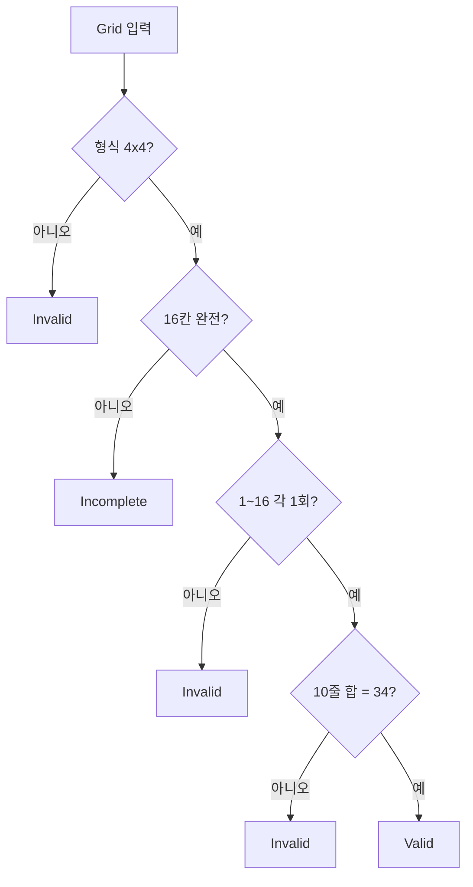

# 4×4 Magic Square — TDD 설계 보고서

| 항목 | 내용 |
|------|------|
| **프로젝트** | MagicSquare_xx |
| **문서 유형** | TDD 설계 (계약·테스트 전략·케이스·구현 순서) |
| **범위** | 4×4 판정기(validator) 1차, 구현·테스트 소스 코드 제외 |
| **선행 문서** | [01-problem-definition-report.md](01-problem-definition-report.md) |
| **작성 기준일** | 2026-05-28 |
| **버전** | 1.0 |

---

## 목차

0. [메타데이터](#0-메타데이터)
1. [TDD 설계 목적과 범위](#1-tdd-설계-목적과-범위)
2. [도메인 계약 (Behavior Contracts)](#2-도메인-계약-behavior-contracts)
3. [불변량 → 테스트 전략 매핑](#3-불변량--테스트-전략-매핑)
4. [미결정 사항 결정안](#4-미결정-사항-결정안)
5. [테스트 계층과 경계](#5-테스트-계층과-경계)
6. [테스트 케이스 카탈로그](#6-테스트-케이스-카탈로그)
7. [Red → Green → Refactor 구현 순서](#7-red--green--refactor-구현-순서)
8. [테스트 데이터 및 픽스처 정책](#8-테스트-데이터-및-픽스처-정책)
9. [비기능 (1차 최소)](#9-비기능-1차-최소)
10. [리스크·암묵적 가정](#10-리스크암묵적-가정)
11. [01 보고서 대비 체크리스트](#11-01-보고서-대비-체크리스트)
12. [다음 단계](#12-다음-단계)
- [자체 검수](#자체-검수)
- [부록 A · B · C](#부록-a-테스트-이름-목록)
- [문서 이력](#문서-이력)

---

## 0. 메타데이터

| 항목 | 값 |
|------|-----|
| 프로젝트명 | MagicSquare_xx |
| 문서 유형 | TDD 설계 |
| 1차 대상 | `MagicSquareValidator` (판정기) |
| 선행 문서 | `Report/01-problem-definition-report.md` |
| 후속(범위 밖) | 구현, 테스트 파일, UI, 생성기, n×n |

**한 줄 요약:** 4×4 격자의 **유효 / 비유효 / 미완성** 판정을 테스트 계약으로 고정하고, Red-Green-Refactor로 구현할 수 있는 순서를 제시한다.

---

## 1. TDD 설계 목적과 범위

### 1.1 01 보고서와의 관계

| 01 보고서 (문제 정의) | 본 문서 (TDD 설계) |
|----------------------|-------------------|
| **무엇이** 문제인가 (판별·기준 고정) | **어떤 테스트**로 그 문제를 고정하는가 |
| Invariant I-1 ~ I-12 | 각 Invariant의 검증 방식·케이스 ID |
| 미결정 4항목 | Default 결정안 + 테스트 영향 |
| 비목표 (생성·UI·n×n) | 테스트 범위에서 **명시적 제외** |

### 1.2 포함 / 제외

| 구분 | 내용 |
|------|------|
| **포함** | 행위 계약, 판정 결과 타입, 테스트 계층, 케이스 카탈로그, 구현 순서, 픽스처 표, 회귀 골든 목록 |
| **제외** | 소스 코드, 테스트 프레임워크 프로젝트, UI, 자동 완성/생성, 해 열거, 동치 분류, n×n |
| **선택(2차)** | 위반 설명 API (`describeViolations`) — 1차 계약에 **훅만** 정의 |

### 1.3 1차 성공 기준

> **판정기 계약이 테스트 ID 집합으로 고정되었고**, Red-Green-Refactor 1단계(입력 형식 검증)부터 착수할 수 있다.

---

## 2. 도메인 계약 (Behavior Contracts)

### 2.1 입력

| 항목 | 1차 권장 (Default) |
|------|-------------------|
| **표현** | `Grid` = `int[4][4]` (행 우선, 0-based 인덱스) |
| **의미** | `grid[r][c]` = r행 c열 값 |
| **완전성** | 16칸 모두 **정수**이면 「완전 입력」; 빈 칸·null·비정수는 **별도 정책**(→ `Incomplete` 또는 `Invalid`, [§4.1](#41-미완성-격자-정책)) |

**대안(문서화만):** 길이 16의 1차원 배열(행 우선 flatten) — 1차 구현 후 동일 계약으로 어댑터 추가 가능.

### 2.2 출력

| 결과 | 의미 | 1차 필수 |
|------|------|----------|
| `Valid` | I-2~I-4, I-5 만족 (완전 입력 + 10줄 합 34 + 1~16 각 1회) | 예 |
| `Invalid` | 완전 입력이나 도메인 규칙 위반 | 예 |
| `Incomplete` | 16칸 미충족·정의 밖 값으로 **합 검사 전** 단계에서 종료 | 예 (Default 정책) |

**확장(2차, 비차단):** `describeViolations(grid) → Violation[]` — 실패한 줄 ID, 중복 값 목록 등 (STEP 2 피드백 대응).

### 2.3 공개 행위

| 행위 | 시그니처 (개념) | 책임 |
|------|-----------------|------|
| `validate` | `validate(grid: Grid) → ValidationResult` | 유일한 1차 진입점; `Valid` \| `Invalid` \| `Incomplete` |
| `describeViolations` | (2차) `describeViolations(grid) → Violation[]` | `Invalid`일 때만 의미; 1차 테스트 스킵 가능 |

### 2.4 행위별 계약

#### `validate(grid)`

| | 내용 |
|---|------|
| **전제** | `grid` 참조가 전달됨 (null은 구현 정책: `Invalid` 또는 예외 — **테스트로 고정: `Invalid`**) |
| **후조건** | 반환값 ∈ {`Valid`, `Invalid`, `Incomplete`}; **입력 `grid` 내용·참조 대상 셀 값 불변** (I-10) |
| **불변** | 동일 `grid` 스냅샷 → 동일 결과 (I-6) |
| **순서** | (1) 형식·완전성 → (2) 1~16 집합·중복 → (3) 10줄 합 — `Valid`는 (3)까지 통과 후만 (I-7) |

### 2.5 한 줄 계약

> 완전하고 유효한 4×4·1~16 순열이면 `Valid`; 완전하나 규칙 위반이면 `Invalid`; 완전하지 않으면 `Incomplete`.

---

## 3. 불변량 → 테스트 전략 매핑

| ID | 의미 (한 줄) | 검증 방식 | 대표 테스트 ID |
|----|--------------|-----------|----------------|
| I-1 | 4×4, 칸당 하나 | 입력 전처리·크기 검사 | TC-E-01, TC-E-02 |
| I-2 | 1~16, 서로 다름 | 집합·중복 검사 단위 + 통합 | TC-U-01, TC-I-01 |
| I-3 | 10줄 정의 | 줄 추출 단위 (행/열/대각) | TC-U-02 ~ TC-U-04 |
| I-4 | 유효 시 10줄 합 동일 | 합 검사 통합 | TC-V-01, TC-I-02 |
| I-5 | 공통 합 = 34 | 기대 상수 34 단언 | TC-V-01, TC-I-03 |
| I-6 | 결정론 | 동일 grid 2회 호출 동일 결과 | TC-R-01 |
| I-7 | Valid는 전부 검사 후 | 부분 통과 격자 → Invalid | TC-I-02 |
| I-8 | I-2 위반 → 비유효 | 중복·범위·누락 | TC-I-01, TC-I-04 |
| I-9 | I-4 위반 → 비유효 | 한 줄만 틀림 | TC-I-02, TC-I-05 |
| I-10 | 입력 불변 | validate 전후 grid deep equal | TC-R-02 |
| I-11 | 완전성 정책 일치 | Incomplete vs Invalid 경계 | TC-E-03 ~ TC-E-05 |
| I-12 | 출력 의미 회귀 | Golden Master 목록 | TC-G-01 ~ TC-G-04 |

---

## 4. 미결정 사항 결정안

### 4.1 미완성 격자 정책

| | 내용 |
|---|------|
| **Default** | `Incomplete`를 `Invalid`와 **분리** |
| **대안** | 모든 비유효를 단일 `Invalid` |
| **이유** | STEP 2 피드백(「아직 다 채우지 않음」 vs 「틀림」); 학습 시나리오와 I-11 명확화 |
| **영향 테스트** | TC-E-03, TC-E-04, TC-G-02 |

### 4.2 출력 수준

| | 내용 |
|---|------|
| **Default** | 1차: `validate` → 3값만; 2차: `describeViolations` |
| **대안** | 1차부터 위반 줄·중복 반환 |
| **이유** | 계약 최소화·Red 단계 단순화; 피드백은 추가 행위로 분리 |
| **영향 테스트** | 1차 TC-I-* 만; 2차 TC-X-* (문서화만, ID 예약) |

### 4.3 이해관계자·시나리오

| | 내용 |
|---|------|
| **Default** | 학습자가 손으로 채운 격자를 **입력 → 판정** |
| **대안** | 데모용 고정 격자만 |
| **이유** | 01 보고서 Why #1(자기 확인); 픽스처는 고정·수동 입력 둘 다 동일 API |
| **영향 테스트** | 시나리오 무관; TC-V-* / TC-I-* 동일 |

### 4.4 1차 범위

| | 내용 |
|---|------|
| **Default** | **판정기만** |
| **대안** | 생성·UI 포함 |
| **이유** | STEP 5 비목표·판정/생성 분리 (I-P drift 방지) |
| **영향 테스트** | 생성 관련 TC 없음 |

---

## 5. 테스트 계층과 경계

### 5.1 계층

| 계층 | 대상 | 예시 |
|------|------|------|
| **단위** | 줄 합, 대각 인덱스, 1~16 집합, 마법 상수 | `LineSumChecker`, `UniquenessChecker` |
| **통합** | `validate` end-to-end | TC-V-*, TC-I-*, TC-E-* |
| **회귀** | Golden Master 스냅샷 | TC-G-* |

### 5.2 하지 않을 테스트

- 마방진 **생성**·자동 완성
- UI·입력 위젯
- 성능·부하
- n×n, 3×3
- 해 개수·동치류

### 5.3 모듈 경계 (제안)

| 모듈 | 책임 |
|------|------|
| `Grid` | 4×4 타입·크기 검사 |
| `InputCompletenessChecker` | Incomplete vs 완전 |
| `UniquenessChecker` | 1~16 각 1회 |
| `LineEnumerator` | 10줄 좌표/값 나열 |
| `LineSumChecker` | 한 줄 합, 목표 34 |
| `MagicSquareValidator` | 파이프라인 조합, `validate` |

### 5.4 파이프라인

---

## 6. 테스트 케이스 카탈로그

### 6.1 정상 (Valid)

| ID | 이름 | Given | When | Then |
|----|------|-------|------|------|
| TC-V-01 | `valid_standard_durer_type` | 부록 B `G_VALID_A` | `validate` | `Valid` |
| TC-V-02 | `valid_alternate_permutation` | 부록 B `G_VALID_B` | `validate` | `Valid` |

### 6.2 구조·입력 오류

| ID | 이름 | Given | When | Then |
|----|------|-------|------|------|
| TC-E-01 | `reject_wrong_dimensions_3x4` | 3×4 정수 배열 | `validate` | `Invalid` |
| TC-E-02 | `reject_wrong_dimensions_5x5` | 5×5 | `validate` | `Invalid` |
| TC-E-03 | `incomplete_empty_cell` | 16칸 중 1칸 null/미정 | `validate` | `Incomplete` |
| TC-E-04 | `incomplete_only_12_cells` | 12개만 채움 | `validate` | `Incomplete` |
| TC-E-05 | `invalid_out_of_range_value` | 완전 16칸, 하나가 0 또는 17 | `validate` | `Invalid` |
| TC-E-06 | `invalid_null_grid_reference` | grid = null | `validate` | `Invalid` |

### 6.3 도메인 위반 (Invalid — 완전 채움)

| ID | 이름 | Given | When | Then |
|----|------|-------|------|------|
| TC-I-01 | `invalid_duplicate_values` | 1~16 중복 포함 완전 격자 | `validate` | `Invalid` |
| TC-I-02 | `invalid_one_row_wrong_sum` | 한 행만 합 ≠ 34 | `validate` | `Invalid` |
| TC-I-03 | `invalid_wrong_constant_all_lines_equal` | 10줄 합은 같으나 34가 아님 (예: 모두 30) | `validate` | `Invalid` |
| TC-I-04 | `invalid_missing_number_in_set` | 16칸 완전, 1~16 집합 아님 (예: 1 빠지고 17 없이 16 두 번) | `validate` | `Invalid` |
| TC-I-05 | `invalid_main_diagonal_only` | 행·열 OK, 주대각만 ≠ 34 | `validate` | `Invalid` |
| TC-I-06 | `invalid_anti_diagonal_only` | 반대각만 ≠ 34 | `validate` | `Invalid` |
| TC-I-07 | `invalid_multiple_line_failures` | 2행 이상 합 오류 | `validate` | `Invalid` |

### 6.4 경계·불변

| ID | 이름 | Given | When | Then |
|----|------|-------|------|------|
| TC-B-01 | `invalid_accidental_equal_sums_wrong_set` | 10줄 합 우연 일치 가능성 낮은 집합 위반 격자 | `validate` | `Invalid` |
| TC-B-02 | `transpose_valid_remains_valid` | `G_VALID_A`의 전치 격자 | `validate` | `Valid` (1차: 동일 판정; 동치 분류 비목표) |

### 6.5 단위 (Uniqueness / Line)

| ID | 이름 | Given | When | Then |
|----|------|-------|------|------|
| TC-U-01 | `uniqueness_detects_duplicate` | [1,1,2,...] flat 16 | `UniquenessChecker` | false |
| TC-U-02 | `line_sum_row_all_34` | `G_VALID_A` 0행 | `LineSumChecker` | 34 |
| TC-U-03 | `line_sum_column_all_34` | `G_VALID_A` 0열 | `LineSumChecker` | 34 |
| TC-U-04 | `main_diagonal_indices` | `G_VALID_A` | `LineEnumerator.mainDiagonal` | [0,0],[1,1],[2,2],[3,3] 값 합 34 |

### 6.6 회귀·계약 (I-12)

| ID | 이름 | Given | When | Then |
|----|------|-------|------|------|
| TC-R-01 | `deterministic_double_call` | `G_VALID_A` | `validate` × 2 | 동일 결과 |
| TC-R-02 | `does_not_mutate_input` | `G_VALID_A` 복사본 | `validate` 후 grid 비교 | deep equal |
| TC-G-01 | `golden_valid_a` | `G_VALID_A` | `validate` | `Valid` |
| TC-G-02 | `golden_incomplete` | 부록 B `G_INCOMPLETE` | `validate` | `Incomplete` |
| TC-G-03 | `golden_invalid_dup` | 부록 B `G_INVALID_DUP` | `validate` | `Invalid` |
| TC-G-04 | `golden_invalid_row` | 부록 B `G_INVALID_ROW` | `validate` | `Invalid` |

---

## 7. Red → Green → Refactor 구현 순서

| 순서 | 목표 | 통과 테스트 ID | 리팩터링 힌트 |
|------|------|----------------|---------------|
| 1 | 4×4 형식만 | TC-E-01, TC-E-02, TC-E-06 | `Grid` 타입·가드 |
| 2 | Incomplete 분기 | TC-E-03, TC-E-04, TC-G-02 | `InputCompletenessChecker` 추출 |
| 3 | 1~16 집합·범위 | TC-E-05, TC-I-01, TC-I-04, TC-U-01 | `UniquenessChecker` |
| 4 | 한 줄 합 | TC-U-02, TC-U-03 | `LineSumChecker` |
| 5 | 10줄 열거 | TC-U-04, TC-I-05, TC-I-06 | `LineEnumerator` |
| 6 | 전체 Valid | TC-V-01, TC-V-02, TC-G-01 | `MagicSquareValidator` 통합 |
| 7 | Invalid 합·다중 위반 | TC-I-02, TC-I-03, TC-I-07, TC-G-04 | 상수 34 중앙화 |
| 8 | 경계·우연 합 | TC-B-01, TC-I-03 | 검사 순서: 집합 → 합 |
| 9 | 결정론·불변 | TC-R-01, TC-R-02 | 입력 복사 금지 문서화 |
| 10 | 회귀 전체 | TC-G-01 ~ TC-G-04 | Golden 파일 분리 |
| 11 | (2차) 위반 설명 | TC-X-* 예약 | `describeViolations` |

---

## 8. 테스트 데이터 및 픽스처 정책

- 모든 격자는 **부록 B 표**에 고정값으로 둔다.
- 테스트 간 **공유 상수** `G_*` 로 import; 런타임 랜덤 없음.
- Property-based / fuzz: **1차 제외** (4×4 전체 공간이 작아 수동 픽스처로 충분).

---

## 9. 비기능 (1차 최소)

| 항목 | 1차 |
|------|-----|
| 실행 시간 | 4×4 고정 — 무시 가능 |
| 메모리 | 무시 가능 |
| 로깅 | 비목표 |
| i18n | 비목표 |

---

## 10. 리스크·암묵적 가정

| 리스크 | 완화 |
|--------|------|
| 「완성」≠「유효」 혼동 | API 이름 `validate` not `complete`; TC-E vs TC-I 분리 |
| 짝수 차수 **구성법** 혼입 | 테스트에 구성 알고리즘 없음 |
| 부분 검증으로 Valid 오판 | I-7: TC-I-02, TC-I-05; 파이프라인 순서 고정 |
| 테스트가 요구사항 **과소** | 10줄 + 집합 모두 TC 존재 |
| 테스트가 요구사항 **과대** | 생성·UI TC 없음 명시 |
| `Incomplete` 미사용 시 drift | TC-G-02 회귀 필수 |

---

## 11. 01 보고서 대비 체크리스트

| 01 「표면 vs 개선」 | TDD 반영 |
|---------------------|----------|
| 초점: 완성 → 판별 | Yes — `validate` only |
| 성공: 격자 채움 → 일관 판정 | Yes — TC-R-01 |
| 산출물: 정답 격자 → 유효성 | Yes — Valid/Invalid/Incomplete |
| 훈련: 퍼즐 → 규칙·계약 | Yes — Invariant 매핑 §3 |

---

## 12. 다음 단계

1. 테스트 러너·언어 선택 (부록 C 참고 1종).
2. **순서 1** Red: TC-E-01 실패하는 빈 `validate` 스텁.
3. `src/` / `tests/` 디렉터리는 팀 규약에 맞게 생성.
4. CI·커버리지: 1차 통과 후 도입.

**루트 README 갱신:** 사용자 요청 시에만 — 본 설계의 Default 결정을 「다음에 결정할 것」에 반영 가능 (부록 기록).

---

## 자체 검수

| # | 항목 | 결과 |
|---|------|------|
| 1 | 구현·테스트 소스 코드가 본문에 없는가? | **예** |
| 2 | I-1~I-12가 테스트 전략에 연결되었는가? | **예** (§3) |
| 3 | 10줄 검사가 누락되지 않았는가? | **예** (TC-U-02~04, TC-I-05/06) |
| 4 | 1~16 서로 다름이 독립 테스트인가? | **예** (TC-U-01, TC-I-01) |
| 5 | 판정이 입력을 변경하지 않음이 테스트되었는가? | **예** (TC-R-02) |
| 6 | 생성·UI·n×n가 비목표인가? | **예** (§1.2, §5.2) |
| 7 | Red-Green-Refactor 순서가 있는가? | **예** (§7) |
| 8 | 미결정 4항목이 결정안으로 닫혔는가? | **예** (§4) |

---

## 부록 A. 테스트 이름 목록

| ID | 이름 |
|----|------|
| TC-V-01 | valid_standard_durer_type |
| TC-V-02 | valid_alternate_permutation |
| TC-E-01 | reject_wrong_dimensions_3x4 |
| TC-E-02 | reject_wrong_dimensions_5x5 |
| TC-E-03 | incomplete_empty_cell |
| TC-E-04 | incomplete_only_12_cells |
| TC-E-05 | invalid_out_of_range_value |
| TC-E-06 | invalid_null_grid_reference |
| TC-I-01 | invalid_duplicate_values |
| TC-I-02 | invalid_one_row_wrong_sum |
| TC-I-03 | invalid_wrong_constant_all_lines_equal |
| TC-I-04 | invalid_missing_number_in_set |
| TC-I-05 | invalid_main_diagonal_only |
| TC-I-06 | invalid_anti_diagonal_only |
| TC-I-07 | invalid_multiple_line_failures |
| TC-B-01 | invalid_accidental_equal_sums_wrong_set |
| TC-B-02 | transpose_valid_remains_valid |
| TC-U-01 ~ 04 | (단위, §6.5) |
| TC-R-01, TC-R-02 | deterministic / no mutation |
| TC-G-01 ~ 04 | golden masters |

---

## 부록 B. 참고 격자 데이터

### G_VALID_A (표준 4×4 마방진 예시, 합 34)

| | c0 | c1 | c2 | c3 |
|---|-----|-----|-----|-----|
| r0 | 16 | 3 | 2 | 13 |
| r1 | 5 | 10 | 11 | 8 |
| r2 | 9 | 6 | 7 | 12 |
| r3 | 4 | 15 | 14 | 1 |

### G_VALID_B (대안 유효 배치)

| | c0 | c1 | c2 | c3 |
|---|-----|-----|-----|-----|
| r0 | 1 | 15 | 14 | 4 |
| r1 | 12 | 6 | 7 | 9 |
| r2 | 8 | 10 | 11 | 5 |
| r3 | 13 | 3 | 2 | 16 |

### G_INCOMPLETE (미완성 — TC-G-02)

| | c0 | c1 | c2 | c3 |
|---|-----|-----|-----|-----|
| r0 | 16 | 3 | 2 | 13 |
| r1 | 5 | 10 | **·** | 8 |
| r2 | 9 | 6 | 7 | 12 |
| r3 | 4 | 15 | 14 | 1 |

(구현 시 「·」= null 또는 sentinel)

### G_INVALID_DUP (중복)

`G_VALID_A`에서 [3][3]=1 → 1이 (0,0)과 (3,3)에 중복.

### G_INVALID_ROW (한 행 합 오류)

`G_VALID_A`에서 r0 마지막 칸 13→20 (r0 합 ≠ 34).

---

## 부록 C. 예시 프레임워크 매핑 (5줄)

- **Jest:** `describe('validate')` / `it('TC-V-01', ...)` / `expect(result).toBe(ValidationResult.Valid)`
- 픽스처: `const G_VALID_A = [[16,3,2,13], ...]`
- Golden: `__fixtures__/golden.json` 에 TC-G ID 키

---

## 문서 이력

| 버전 | 일자 | 내용 |
|------|------|------|
| 1.0 | 2026-05-28 | TDD 설계 초판 |

---

*본 문서는 구현·테스트 코드를 포함하지 않는다.*
