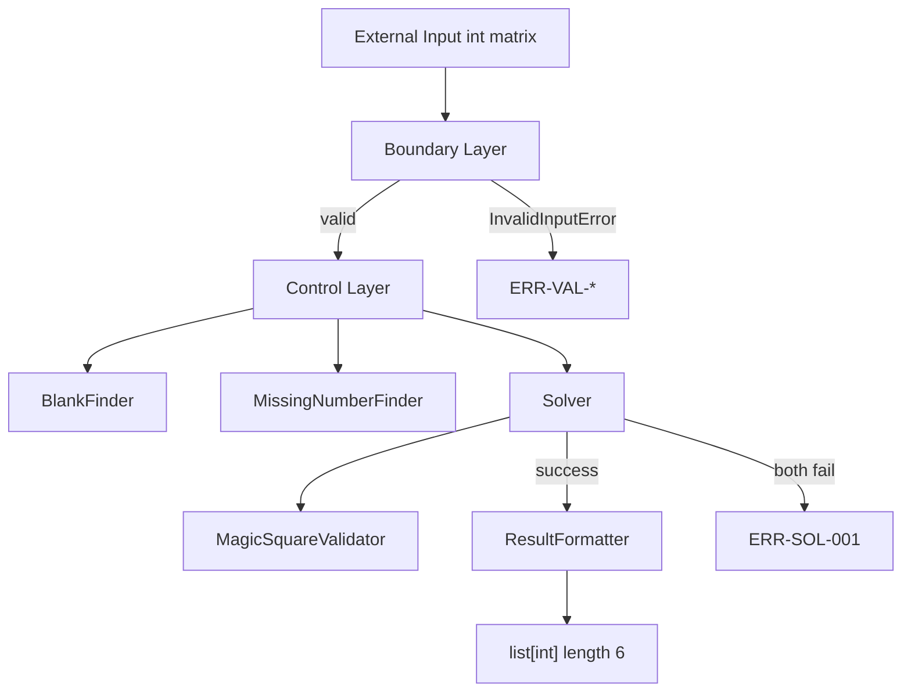

# PRD — Magic Square 4x4 TDD Practice

| 항목 | 내용 |
|------|------|
| **문서 ID** | PRD-MSQ-4x4-001 |
| **버전** | 1.0 (Draft) |
| **상태** | 구현 전 기준 문서 |
| **저장 경로** | `docs/PRD_MagicSquare.md` |
| **작성 기준일** | 2026-05-29 |

---

## 1. Executive Summary

Magic Square 4x4 TDD Practice는 4×4 격자에 빈칸 2개(`0`)가 있는 부분 완성 마방진을 입력받아, 누락 숫자 2개를 올바른 위치에 배치한 결과를 `int[6]` 형식으로 반환하는 **순수 로직 훈련 프로젝트**이다. 알고리즘 난이도보다 **불변식 기반 설계·검증 사고**, **입력/출력 계약 고정**, **Boundary와 Domain 분리**, **Dual-Track TDD(Track A: Boundary/UI Contract, Track B: Domain/Logic Invariant)**, **RED → GREEN → REFACTOR** 흐름을 훈련하는 것이 1차 목표이다. UI·DB·Web 없이 콘솔 또는 테스트 실행으로 검증 가능하며, 모든 요구사항은 테스트로 증명 가능한 문장으로 정의한다.

**훈련 핵심 역량:**

- 불변식 사고
- 입력/출력 계약
- Dual-Track TDD
- 설계 → 테스트 → 구현 → 리팩토링 흐름

---

## 2. Background

[Report/01-problem-definition-report.md](../Report/01-problem-definition-report.md)에 따르면, 4×4 마방진 문제는 **작지만 짝수 차수**라서 설계·학습 경계가 드러나는 최소 사례이며, 핵심 병목은 「격자 완성」이 아니라 **행·열·대각선 합 규칙을 신뢰할 수 있게 판별하는 것**이다. 학습자는 수동 검산 부담, 마법 상수(34) 혼동, 부분 오류 발견 어려움, 「완성 vs 검증」 목표 이중성을 겪는다.

본 프로젝트는 「마방진 퍼즐 풀이기」가 아니라, **규칙을 실행 가능한 계약(테스트)으로 고정하고 구현이 그 계약을 깨지 않게 하는 TDD 훈련**이다. 프로그램의 역할은 반복 가능한 자동 검증, 규칙 명시화, 판정과 생성(또는 완성 시도)의 책임 분리이다. 저장소는 구현 전 단계에서 **무엇을 관찰·검증할 것인가**를 먼저 고정하는 엔지니어링 프로세스를 따른다.

---

## 3. Problem Statement

### 3.1 정확한 문제 정의

> **「4×4 정수 격자(빈칸 2개)가 주어졌을 때, 누락 숫자 2개를 정의된 배치 순서로 시도하여 마방진 불변식을 만족하는 완성 결과를, 1-index 좌표와 함께 `int[6]` 계약으로 일관되게 반환하는 것」**

표면적 목표인 「마방진을 만든다」가 아니라, 다음 **검증 가능한 불변식 조건**을 완성·보호하는 것이 문제이다.

| 불변식 영역 | 조건 |
|-------------|------|
| 구조 | 4×4, 빈칸(`0`) 정확히 2개 |
| 값 | `0` 또는 `1~16`, `0` 제외 중복 없음 |
| 마방진 | 4행·4열·2대각선 합 = 34 |
| 출력 | `[r1,c1,n1,r2,c2,n2]`, 좌표 1-index |
| 시도 순서 | small-first → 실패 시 reverse |

### 3.2 입력/출력 계약이 핵심인 이유

- **재현 가능한 픽스처**: 동일 입력 → 동일 출력이 테스트 기준을 고정한다.
- **Boundary/Domain 분리**: 입력 검증 실패와 도메인 풀이 실패를 다른 계층·다른 오류 코드로 분리한다.
- **회귀 보호**: 출력 의미(`int[6]` 6원소, 1-index)가 리팩토링 후에도 유지되어야 한다.
- **부분 검증 방지**: 행·열·대각·중복·범위·빈칸 개수를 모두 검사한 뒤에만 「성공」을 선언한다.

---

## 4. Why Now / Why Chain

| Why | 내용 |
|-----|------|
| **Why #1 — 완성?** | 학습자는 「맞게 채웠는지」 즉시 판별 도구가 필요하나, 실제 병목은 **검증·피드백**이다. |
| **Why #2 — 프로그램?** | 10개 줄 합 비교의 반복·피로·산술 실수를 **규칙 기반 자동 판정**으로 대체한다. |
| **Why #3 — TDD?** | 불변식·입출력·판정 의미를 **테스트(계약)** 로 먼저 고정해 요구사항 drift를 막는다. |
| **Why Now** | 구현 전에 계약·불변식·계층 경계를 PRD로 고정하지 않으면 아래 문제가 반복된다. |

**학습자 Pain Point (Why Chain 종단)**

| Pain Point | 결과 |
|------------|------|
| 구현을 먼저 시작함 | 테스트 기준 없이 코드가 요구사항을 대체함 |
| 테스트 기준이 불명확함 | RED/GREEN 전환이 주관적임 |
| Boundary와 Domain 책임이 섞임 | 입력 검증과 풀이 로직이 한 모듈에 결합됨 |
| 리팩토링 후 계약이 깨짐 | 좌표 0/1-index 혼동, 출력 길이 변경 등 회귀 |

---

## 5. Target Users

| Persona | 목적 | 사용 환경 |
|---------|------|-----------|
| **TDD 학습자** | RED-GREEN-REFACTOR, 불변식 테스트 작성 | `pytest` 실행, 로컬 CLI |
| **코드 리뷰어** | 계층 분리·계약 준수·테스트 신뢰도 검수 | PR diff, 커버리지 리포트 |
| **Clean Architecture/ECB 학습자** | Boundary–Control–Entity 의존 방향 훈련 | `src/` ECB 구조 |

**범위 밖 사용자/환경**: UI 최종 사용자, DB/Web API 운영자, 모바일 앱 사용자.

---

## 6. Vision & Epic Goal

### Epic

> **「불변식 기반 사고 훈련 시스템 구축」**

### Epic Goal

[Report/06-magicsquare-user-journey-level1-5_Report.md](../Report/06-magicsquare-user-journey-level1-5_Report.md) Level 1~5 흐름에 따라, Epic → User Journey → User Story → Technical Scenario → Verification이 **Concept → Rule → Use Case → Contract → Test → Component** 추적성으로 연결된 TDD 실습 베이스를 만든다.

| 목표 축 | 성공 상태 |
|---------|-----------|
| Business | 부분 완성 4×4 입력에 대해 정의된 순서로 올바른 완성 좌표·숫자를 반환 |
| Learning | Dual-Track TDD, ECB, 불변식 테이블, Traceability Matrix 운용 |
| Quality | Domain 95%+, Boundary 85%+ 커버리지, 결정론적 실행 |

---

## 7. Persona

**Primary Persona: TDD 학습 중인 Python 개발자**

- 알고리즘 정답보다 **설계·계약·테스트·리팩토링 흐름**을 훈련하려 한다.
- Clean Architecture에서 **Boundary(입출력 계약)** 와 **Domain(불변식)** 을 분리하려 한다.
- 「작은 누락 숫자 → 첫 빈칸」 같은 **명시적 비즈니스 규칙**을 테스트로 고정하는 경험을 원한다.
- 콘솔 또는 테스트 러너로 즉시 피드백을 받는다.

---

## 8. User Journey Summary

[Report/06](../Report/06-magicsquare-user-journey-level1-5_Report.md) Level 2 5-Stage Journey를 반영한다.

| Stage | Action | Pain Point | Learning Outcome |
|-------|--------|------------|------------------|
| **1. Problem Recognition** | 「완성」이 아닌 「불변식 판별+빈칸 2개 완성」로 문제 재정의 | 완성/검증 혼동 | I/O 계약과 비목표(UI/DB/Web) 구분 |
| **2. Contract Definition** | 입력(4×4, `0`×2, 1~16) / 출력(`int[6]`, 1-index) 고정 | 좌표 0/1-index 혼동 | Track A 테스트 가능 계약 문서화 |
| **3. Domain Separation** | BlankFinder, MissingNumberFinder, Validator, Solver 분리 | Boundary에 도메인 규칙 혼입 | ECB 의존 방향 준수 |
| **4. Dual-Track TDD Progress** | Track A(검증)·Track B(풀이) 병렬 RED→GREEN | Domain 전부 구현 후 Boundary 붙이기 | 최소 구현, 테스트 약화 금지 |
| **5. Regression Protection** | Golden fixture, Traceability Matrix 유지 | 리팩토링 후 출력 깨짐 | REFACTOR 후 전체 suite + 커버리지 유지 |

---

## 9. Scope

### 9.1 In-Scope

- 4×4 정수 행렬 입력 처리
- Boundary 입력 검증(크기, 빈칸 2개, 값 범위, 중복)
- row-major 첫 번째 빈칸 좌표 탐색
- 누락 숫자 2개 탐색 및 오름차순 정렬
- 마방진 판정(행·열·대각, 상수 34)
- small-first 시도 → 실패 시 reverse 시도
- 성공 시 `int[6]` 반환; 실패 시 정의된 오류 정책 적용
- Dual-Track TDD에 따른 테스트 가능 요구사항
- Concept–Component Traceability Matrix

### 9.2 Out-of-Scope

- UI 화면 개발
- DB 저장/검색
- Web/API 서버 개발
- N×N 일반화
- 임의 마방진 **생성** 알고리즘(전체 탐색/구성법)
- 사용자 인증/권한
- 네트워크 오류 처리
- QR 스캔, 외부 서비스 연동
- 위반 상세 설명 API (`describeViolations`) — Report/02 2차 항목, 본 PRD 비범위

---

## 10. Functional Requirements

### FR-01 Input Verification (Boundary)

- **Description**: Boundary는 Domain resolver 호출 전에 입력 행렬의 구조·값·빈칸·중복 규칙을 검증한다.
- **Layer**: Boundary
- **Input**: `int[][]` (외부 raw matrix)
- **Processing Rules**:
  1. 행 개수 = 4, 각 행 길이 = 4가 아니면 실패.
  2. 모든 원소 ∈ {0} ∪ {1..16}이 아니면 실패.
  3. `0` 개수 ≠ 2이면 실패.
  4. `0`을 제외한 값에 중복이 있으면 실패.
  5. 위 1~4 중 하나라도 실패하면 Domain resolver를 호출하지 않는다.
- **Output**: 검증 통과 시 Control에 normalized grid 전달; 실패 시 `InvalidInputError`(§13) 발생.
- **Acceptance Criteria**:
  - AC-FR01-01: 3×4 행렬 입력 시 `ERR-VAL-001`과 함께 Domain 미호출.
  - AC-FR01-02: `0`이 1개인 행렬 입력 시 `ERR-VAL-002`와 함께 Domain 미호출.
  - AC-FR01-03: 값 `17` 포함 행렬 입력 시 `ERR-VAL-003`과 함께 Domain 미호출.
  - AC-FR01-04: `0` 제외 중복 행렬 입력 시 `ERR-VAL-004`와 함께 Domain 미호출.
  - AC-FR01-05: 유효 입력 시 Boundary 검증 통과 후 Control/Domain 호출됨.
- **Error / Exception Policy**: §13 Boundary 검증 오류表 참조.
- **Related Business Rules**: BR-01, BR-02, BR-03, BR-04
- **Related Test Direction**: Track A — `SC-BND-VAL-001`~`003`, RED-BND-001~004
- **Component Candidate**: `BoundaryValidator`

---

### FR-02 Blank Coordinate Discovery

- **Description**: row-major 순서로 스캔하여 첫 번째·두 번째 빈칸(`0`)의 1-index 좌표를 반환한다.
- **Layer**: Entity (Domain)
- **Input**: Boundary 검증을 통과한 `int[4][4]`
- **Processing Rules**:
  1. `r=0..3`, `c=0..3` 순으로 스캔.
  2. 첫 `0` → `(r+1, c+1)` = 첫 빈칸.
  3. 다음 `0` → `(r+1, c+1)` = 두 번째 빈칸.
  4. 정확히 2개를 찾은 뒤 스캔 종료.
- **Output**: `(r1, c1, r2, c2)` — 모두 1-index 정수, `r1,c1`이 row-major 첫 빈칸.
- **Acceptance Criteria**:
  - AC-FR02-01: `0` 위치가 `(0,2)`, `(3,1)`(0-index)일 때 `(1,3,4,2)` 반환.
  - AC-FR02-02: 동일 입력 2회 호출 시 동일 좌표 반환.
  - AC-FR02-03: 호출 전후 입력 행렬 deep equal.
- **Error / Exception Policy**: FR-01 통과 입력만 수신; 빈칸 ≠ 2는 Boundary에서 차단.
- **Related Business Rules**: BR-02, BR-05
- **Related Test Direction**: Track B — RED-DOM-BLK-001~003
- **Component Candidate**: `BlankFinder`

---

### FR-03 Missing Number Discovery

- **Description**: `{1..16}`에서 격자에 존재하지 않는 정확히 2개 숫자를 찾고 오름차순으로 정렬한다.
- **Layer**: Entity (Domain)
- **Input**: Boundary 검증 통과 `int[4][4]`
- **Processing Rules**:
  1. `0`을 제외한 모든 셀 값 집합 `S` 구성.
  2. `{1..16} \ S` = 누락 집합 `M`, `|M| = 2`.
  3. `n1 = min(M)`, `n2 = max(M)`.
- **Output**: `(n1, n2)` where `n1 < n2`
- **Acceptance Criteria**:
  - AC-FR03-01: `1~16` 중 `{5, 12}`만 없으면 `(5, 12)` 반환.
  - AC-FR03-02: 반환값은 항상 `n1 < n2`.
  - AC-FR03-03: 호출 전후 입력 행렬 deep equal.
- **Error / Exception Policy**: FR-01 통과 입력만 수신.
- **Related Business Rules**: BR-06, BR-07
- **Related Test Direction**: Track B — RED-DOM-MIS-001~003
- **Component Candidate**: `MissingNumberFinder`

---

### FR-04 Magic Square Validation

- **Description**: 완전히 채워진 4×4 격자가 마방진 불변식(1~16 각 1회, 10줄 합 34)을 만족하는지 판정한다.
- **Layer**: Entity (Domain)
- **Input**: `int[4][4]` (모든 셀 ≠ 0)
- **Processing Rules**:
  1. 모든 값 ∈ {1..16}, 중복 없음, 16개 각 1회.
  2. 4행, 4열, 주대각, 반대각 각 4원소 합 = 34.
  3. 위 1~2 모두 통과 시 `True`, 하나라도 실패 시 `False`.
- **Output**: `bool`
- **Acceptance Criteria**:
  - AC-FR04-01: Report/02 부록 `G_VALID_A` 완전 격자 → `True`.
  - AC-FR04-02: 한 행 합 ≠ 34인 완전 격자 → `False`.
  - AC-FR04-03: 10줄 합이 모두 34이나 `1~16` 집합 위반 → `False`.
  - AC-FR04-04: 판정 전후 입력 행렬 deep equal.
- **Error / Exception Policy**: 내부 오류 시 예외; `False`는 「비마방진」이지 입력 오류가 아님.
- **Related Business Rules**: BR-03, BR-04, BR-08, BR-09
- **Related Test Direction**: Track B — RED-DOM-VAL-001~004 (Report/02 TC-V-*, TC-I-* 정렬)
- **Component Candidate**: `MagicSquareValidator`

---

### FR-05 Two-Combination Solver and Result Formatting

- **Description**: 누락 숫자 2개를 두 빈칸에 small-first, 실패 시 reverse 순서로 배치·검증하고, 성공 시 `int[6]`로 포맷한다.
- **Layer**: Control(오케스트레이션) + Entity(`Solver`) + Boundary(`ResultFormatter`)
- **Input**: FR-01 통과 `int[4][4]`
- **Processing Rules**:
  1. FR-02로 `(r1,c1,r2,c2)` 획득 (1-index).
  2. FR-03으로 `(n1,n2)` 획득 (`n1 < n2`).
  3. **Attempt 1 (small-first)**: `(r1,c1)←n1`, `(r2,c2)←n2` 임시 완성 격자 생성 → FR-04 검증.
  4. Attempt 1 성공 → `[r1,c1,n1,r2,c2,n2]` 반환.
  5. **Attempt 2 (reverse)**: `(r1,c1)←n2`, `(r2,c2)←n1` → FR-04 검증.
  6. Attempt 2 성공 → `[r1,c1,n2,r2,c2,n1]` 반환.
  7. 둘 다 실패 → `SolverNoValidCompletionError` (`ERR-SOL-001`) 발생 (§13).
  8. 임시 완성은 **입력 행렬 복사본**에만 적용; 원본 불변.
- **Output**: 성공 — `list[int]` 길이 6; 실패 — `SolverNoValidCompletionError`
- **Acceptance Criteria**:
  - AC-FR05-01: Attempt 1만 성공하는 fixture → `[r1,c1,n1,r2,c2,n2]`.
  - AC-FR05-02: Attempt 1 실패·Attempt 2 성공 fixture → `[r1,c1,n2,r2,c2,n1]`.
  - AC-FR05-03: 두 Attempt 모두 실패 fixture → `ERR-SOL-001`, 메시지 고정(§13).
  - AC-FR05-04: 반환 배열 길이 = 6, 모든 원소 정수.
  - AC-FR05-05: 원본 입력 행렬 deep equal 유지.
- **Error / Exception Policy**: §13 `ERR-SOL-001`
- **Related Business Rules**: BR-05~BR-11, BR-12, BR-13
- **Related Test Direction**: Track B — `SC-DOM-SOL-001`, RED-DOM-SOL-001~005; Track A — RED-BND-OUT-001
- **Component Candidate**: `Solver`, `ResultFormatter`, Control use-case handler

---

## 11. Business Rules / Domain Rules

모든 규칙은 **항상 참**이어야 한다.

| ID | Rule (항상 참) |
|----|----------------|
| **BR-01** | 입력은 정확히 4행×4열 `int` 행렬이다. |
| **BR-02** | `0`(빈칸)은 정확히 2개 존재한다. |
| **BR-03** | 각 셀 값은 `0` 또는 `1~16` (정수)이다. |
| **BR-04** | `0`을 제외한 모든 값은 서로 다르다. |
| **BR-05** | 첫 번째 빈칸은 row-major(행 우선, `r` 증가 후 `c` 증가) 스캔에서 최초 `0` 셀이다. |
| **BR-06** | 누락 숫자는 `{1..16}` 중 격자에 나타나지 않는 정확히 2개이다. |
| **BR-07** | 누락 숫자 `(n1, n2)`는 항상 `n1 < n2` (오름차순)이다. |
| **BR-08** | `n=4` 마방진 마법 상수는 `34`이다. |
| **BR-09** | 완전 채워진 유효 마방진은 4행·4열·주대각·반대각 **10줄** 각각 합 = 34이다. |
| **BR-10** | 출력 좌표 `r`, `c`는 **1-index** (`1 ≤ r,c ≤ 4`)이다. |
| **BR-11** | 성공 출력은 `[r1, c1, n1, r2, c2, n2]` 형식의 길이 6 `int` 배열이다. |
| **BR-12** | Attempt 1은 작은 누락 숫자→첫 빈칸, 큰 누락 숫자→두 번째 빈칸 순서이다. |
| **BR-13** | Attempt 2는 Attempt 1 실패 시에만 실행하며, 큰→첫 빈칸, 작은→두 번째 빈칸 순서이다. |
| **BR-14** | 동일 유효 입력에 대한 성공 출력은 항상 동일하다 (결정론). |
| **BR-15** | 풀이·검증·검증 통과 과정은 입력 행렬 원본을 변경하지 않는다. |

---

## 12. Input / Output Contract

### 12.1 Input Contract

| Field / Item | Type | Rule | Valid Example | Invalid Example | Error Code / Failure Policy |
|--------------|------|------|---------------|-----------------|------------------------------|
| Matrix rows | `int` count | = 4 | 4 rows | 3 rows | `ERR-VAL-001` |
| Matrix cols per row | `int` count | each row = 4 | `[4][4]` | `[4][3]` | `ERR-VAL-001` |
| Cell value | `int` | ∈ {0}∪{1..16} | `0`, `7`, `16` | `-1`, `17` | `ERR-VAL-003` |
| Blank count | count of `0` | = 2 | two `0`s | one `0` | `ERR-VAL-002` |
| Non-zero uniqueness | set | all distinct | no dup among 1~16 present | two `5`s | `ERR-VAL-004` |
| Null / empty matrix | reference | non-null, non-empty | 4×4 grid | `null`, `[]` | `ERR-VAL-001` |

### 12.2 Output Contract (Success)

| Field / Item | Type | Rule | Valid Example | Invalid Example | Failure Policy |
|--------------|------|------|---------------|-----------------|----------------|
| Return type | `list[int]` | length = 6 | `[2,3,5,4,1,12]` | length 5 | test failure (contract break) |
| `r1`, `c1` | `int` | 1-index, first blank | `2`, `3` | `0`, `5` | N/A (success only) |
| `n1` | `int` | smaller missing OR Attempt2 first-cell value | `5` | — | see FR-05 |
| `r2`, `c2` | `int` | 1-index, second blank | `4`, `1` | — | — |
| `n2` | `int` | larger missing OR Attempt2 second-cell value | `12` | — | — |
| Order semantics | — | Attempt1: `[r1,c1,n1,r2,c2,n2]`; Attempt2 success: `[r1,c1,n2,r2,c2,n1]` | §16 fixtures | swapped when Attempt1 succeeded | AC-FR05-01/02 |

### 12.3 Output Contract (Failure)

| Condition | Type | Error Code | Domain Called? |
|-----------|------|------------|----------------|
| Input validation fail | Exception `InvalidInputError` | `ERR-VAL-*` | **No** |
| Both attempts fail | Exception `SolverNoValidCompletionError` | `ERR-SOL-001` | **Yes** (full solver path) |

---

## 13. Error / Failure Policy

**확정 정책**: 모든 실패는 **정의된 예외**로 표현한다. 성공 경로만 `list[int]`(길이 6)를 반환한다. 입력 검증 실패 시 **Domain resolver(Solver 및 하위 Entity)는 호출되지 않는다.**

| Error Code | Condition | Message (고정 문자열) | Layer | Domain Resolver Called? | Related AC |
|------------|-----------|----------------------|-------|-------------------------|------------|
| **ERR-VAL-001** | 행/열 ≠ 4×4, null, empty | `"Invalid grid dimensions: expected 4x4."` | Boundary | **No** | AC-FR01-01 |
| **ERR-VAL-002** | `0` 개수 ≠ 2 | `"Invalid blank count: expected exactly 2 zeros."` | Boundary | **No** | AC-FR01-02 |
| **ERR-VAL-003** | 값 ∉ {0}∪{1..16} | `"Invalid cell value: must be 0 or 1..16."` | Boundary | **No** | AC-FR01-03 |
| **ERR-VAL-004** | `0` 제외 중복 | `"Duplicate non-zero value detected."` | Boundary | **No** | AC-FR01-04 |
| **ERR-SOL-001** | Attempt 1·2 모두 비마방진 | `"No valid completion: both placement attempts failed."` | Control (Domain 결과 전달) | **Yes** | AC-FR05-03 |

**예외 타입 계층 (계약 수준)**:

- `MagicSquareError` (base, `.code: str`, `.message: str`)
  - `InvalidInputError` — ERR-VAL-*
  - `SolverNoValidCompletionError` — ERR-SOL-001

---

## 14. Non-Functional Requirements

| ID | Requirement | Verification Method |
|----|-------------|---------------------|
| **NFR-01** | Domain Logic test coverage ≥ **95%** | `pytest-cov` on `entity/` + `control/` domain paths |
| **NFR-02** | Boundary Validation coverage ≥ **85%** | `pytest-cov` on `boundary/` |
| **NFR-03** | **Deterministic execution**: 동일 입력 → 동일 출력 또는 동일 예외 | RED-DOM-DET-001: 2회 호출 동일 assert |
| **NFR-04** | **No side effects**: FR-01~05 실행 전후 입력 행렬 deep equal | RED-DOM-MUT-001 |
| **NFR-05** | **Performance**: 단일 solve 호출 ≤ **50ms** (4×4, 로컬 dev machine 기준) | perf test or timed integration test |
| **NFR-06** | **Maintainability**: Boundary/Domain 책임 분리; ECB import 규칙 준수 | static review + import lint |
| **NFR-07** | **No unexplained magic numbers**: `34`, `4`, `16`, `2`는 named constant로 선언 | code review checklist |
| **NFR-08** | **No hard-coded logic constants** in business rules without name | forbidden pattern scan |
| **NFR-09** | Python **3.10+**, **PEP8**, 전 함수 **type hints** | linter (ruff/black) |
| **NFR-10** | **pytest**, **AAA** pattern, `test_` prefix | CI test run |
| **NFR-11** | 프로젝트 전체 coverage minimum **80%** (Cursor Rules baseline); NFR-01/02가 layer별 상한을 추가 | CI gate |

---

## 15. Dual-Track TDD Strategy

### 15.1 Track A — Boundary / UI Contract TDD

| RED Test Theme | Validates |
|----------------|-----------|
| Input shape 4×4 | ERR-VAL-001, Domain not called |
| Blank count = 2 | ERR-VAL-002 |
| Value range | ERR-VAL-003 |
| Duplicate non-zero | ERR-VAL-004 |
| Output length 6 | AC-FR05-04 |
| Output 1-index coords | AC-FR02, BR-10 |
| Failure exception code/message | §13 table |
| **Domain not invoked on invalid input** | mock/spy on Solver — **0 calls** |

**Track A RED ID 후보**: RED-BND-001~007, SC-BND-VAL-001~003

### 15.2 Track B — Domain / Logic TDD

| RED Test Theme | Validates |
|----------------|-----------|
| BlankFinder row-major | AC-FR02-01 |
| MissingNumberFinder sorted pair | AC-FR03-01 |
| MagicSquareValidator true/false | AC-FR04-01~03 |
| small-first success | AC-FR05-01 |
| small-first fail → reverse success | AC-FR05-02 |
| both attempts fail → ERR-SOL-001 | AC-FR05-03 |
| input immutability | BR-15, NFR-04 |
| determinism | NFR-03 |

**Track B RED ID 후보**: RED-DOM-BLK-*, RED-DOM-MIS-*, RED-DOM-VAL-*, RED-DOM-SOL-*, SC-DOM-SOL-001

### 15.3 Parallel Progression Rules

1. Track A RED와 Track B RED는 **별도 테스트 파일/클래스**로 분리한다.
2. 각 Track의 GREEN은 **해당 Track 실패 테스트만 통과하는 최소 코드**로 작성한다.
3. **REFACTOR** 단계에서만 구조 개선·중복 제거·상수 추출을 수행한다.
4. **금지**: Domain 전부 구현 후 Boundary를 나중에 붙이는 순서.
5. **금지**: assert 약화·테스트 삭제로 GREEN 달성.
6. **금지**: RED 확인(실패 실행 로그) 없이 production 코드 작성.
7. Track A/B는 **같은 Sprint 내 교차 진행** 가능하나, 각 기능 FR별로 RED 증거를 남긴다.

---

## 16. Test Plan / QA

### 16.1 Normal Scenarios

| ID | Scenario | Given | When | Then |
|----|----------|-------|------|------|
| TP-N-01 | small-first success | TD-SUCCESS-SF-001 (§16.4) | solve | `[r1,c1,n1,r2,c2,n2]`, FR-04 True on Attempt 1 |
| TP-N-02 | reverse success | TD-SUCCESS-REV-001 (§16.4) | solve | Attempt 1 False, Attempt 2 True, `[r1,c1,n2,r2,c2,n1]` |

### 16.2 Exception Scenarios

| ID | Scenario | Given | When | Then |
|----|----------|-------|------|------|
| TP-E-01 | invalid size | TD-INVALID-SIZE | solve | ERR-VAL-001, Domain not called |
| TP-E-02 | invalid blank count | TD-INVALID-BLANK | solve | ERR-VAL-002 |
| TP-E-03 | invalid range | TD-INVALID-RANGE | solve | ERR-VAL-003 |
| TP-E-04 | duplicate | TD-DUPLICATE | solve | ERR-VAL-004 |
| TP-E-05 | unsolvable | TD-UNSOLVABLE | solve | ERR-SOL-001 |

### 16.3 Boundary Scenarios

| ID | Check | Expected |
|----|-------|----------|
| TP-B-01 | 최소값 `1` 포함 | 허용 |
| TP-B-02 | 최대값 `16` 포함 | 허용 |
| TP-B-03 | `0`은 빈칸만 | 값 `0`은 FR-04 입력에 사용 안 함 |
| TP-B-04 | 출력 좌표 1-index | `r,c ∈ [1,4]` |
| TP-B-05 | 반환 배열 길이 | `len == 6` |

### 16.4 Representative Test Data

| Fixture ID | Purpose | Structural Specification |
|------------|---------|--------------------------|
| **TD-SUCCESS-SF-001** | Attempt 1만 성공 | `G_VALID_A`에서 2칸을 `0`으로; row-major 첫 빈칸에 `n1`, 둘째에 `n2` 배치 시 유효 마방진 |
| **TD-SUCCESS-REV-001** | Attempt 1 실패, Attempt 2 성공 | 동일 제약; `(n1→blank1, n2→blank2)` invalid, `(n2→blank1, n1→blank2)` valid |
| **TD-INVALID-SIZE** | 3×4 또는 5×5 | — |
| **TD-INVALID-BLANK** | `0` 1개 또는 3개 | — |
| **TD-DUPLICATE** | `0` 제외 동일 값 2회 | — |
| **TD-INVALID-RANGE** | `-1` 또는 `17` 포함 | — |
| **TD-UNSOLVABLE** | FR-01 통과; Attempt 1·2 모두 FR-04 False | RED 단계에서 수치 확정 |

**TD-SUCCESS-SF-001 구체 예시 (Report/02 `G_VALID_A` 기반)**  
`G_VALID_A`에서 `(0,0)=16`, `(3,3)=1`을 `0`으로 치환 → 누락 `{1,16}`, row-major 빈칸 `(1,1)`, `(4,4)` → Attempt 1 성공 → **`[1,1,1,4,4,16]`**

> **Decision Needed**: TD-SUCCESS-REV-001의 구체 행렬 값은 RED 설계 단계에서 수치 확정 필요 ([Report/06](../Report/06-magicsquare-user-journey-level1-5_Report.md) 보강 권고).

---

## 17. Architecture Overview (High-Level)



| Layer | Responsibility | Must NOT |
|-------|----------------|----------|
| **Boundary** | 입력 검증, 예외→호출자 전달, 출력 형식 최종 확인 | Domain 불변식 직접 구현, Solver 알고리즘 |
| **Control** | FR-05 Attempt 순서 오케스트레이션, Entity 조합 | UI/CLI 세부, raw I/O 파싱 |
| **Entity (Domain)** | BlankFinder, MissingNumberFinder, MagicSquareValidator, Solver 핵심 규칙 | Boundary/Control import, I/O |

**의존 방향**: Boundary → Control → Entity  
**금지**: Entity → Control, Entity → Boundary, Control → Boundary

---

## 18. Component Candidates

| Component | Responsibility | Layer | Input | Output | Related FR | Related Test |
|-----------|----------------|-------|-------|--------|------------|--------------|
| **BoundaryValidator** | FR-01 입력 계약 검증 | Boundary | raw `int[][]` | pass / `InvalidInputError` | FR-01 | RED-BND-001~004 |
| **BlankFinder** | row-major 빈칸 2개 1-index | Entity | valid grid | `(r1,c1,r2,c2)` | FR-02 | RED-DOM-BLK-* |
| **MissingNumberFinder** | 누락 2개 오름차순 | Entity | valid grid | `(n1,n2)` | FR-03 | RED-DOM-MIS-* |
| **MagicSquareValidator** | 10줄 합 34 + 1~16 | Entity | full grid | `bool` | FR-04 | RED-DOM-VAL-* |
| **Solver** | Attempt 1/2, 복사본 채움 | Entity | valid grid + helpers | placement result / fail | FR-05 | RED-DOM-SOL-* |
| **ResultFormatter** | `[r1,c1,n1,r2,c2,n2]` 조립 | Boundary or Control | tuple parts | `list[int]` len 6 | FR-05 | RED-BND-OUT-001 |

---

## 19. Risks & Ambiguities

| Risk | Impact | Decision / Mitigation |
|------|--------|----------------------|
| 1-index vs 0-index 혼동 | 잘못된 좌표 출력, AC-FR02/05 실패 | BR-10, Track A 전용 테스트; 내부 0-index, Boundary에서만 +1 |
| row-major 첫 빈칸 정의 누락 | Attempt 순서 오류 | BR-05, AC-FR02-01 fixture |
| small-first vs reverse fixture 혼동 | 잘못된 GREEN | TD-SUCCESS-SF vs TD-SUCCESS-REV 분리 명명 |
| 입력 행렬 변경 여부 불명확 | 회귀·부작용 | BR-15, NFR-04, RED-DOM-MUT-001 |
| 두 조합 모두 실패 정책 | API 모호 | **확정**: `SolverNoValidCompletionError` / ERR-SOL-001 |
| 34 상수 하드코딩 | 유지보수·의도 불명 | NFR-07, named constant `MAGIC_CONSTANT_N4 = 34` |
| Boundary/Domain 책임 혼합 | ECB 위반, Track A/B 불가 | FR별 Layer 필드, import lint |
| Report/02(validator-only) vs 본 PRD(solver) 범위 | 문서·테스트 drift | §22 Decision Needed |
| 커버리지 80% vs 95%/85% | CI gate 불일치 | §22 Decision Needed |

---

## 20. Engineering Principles

[Report/03-cursorrules-work-report.md](../Report/03-cursorrules-work-report.md) 및 `.cursorrules`, `.cursor/rules/*.mdc` 요약:

| Principle | Rule |
|-----------|------|
| Language | Python 3.10+ |
| Style | PEP8, max line length 88, Google docstrings on public API |
| Typing | 모든 함수 parameter/return type hints 필수 |
| Architecture | ECB: boundary / control / entity |
| Dependency | boundary→control→entity only |
| TDD | RED(실패 확인) → GREEN(최소 구현) → REFACTOR(동작 보존) |
| Testing | pytest, AAA, `test_` prefix, fixture default scope `function` |
| Coverage | minimum 80%; PRD layer targets 95%/85% (§22) |
| Forbidden | `print()` → `logging`; bare `except:` 금지; RED 없이 구현 금지; 테스트 약화 금지; 설명 없는 magic number/하드코딩 상수 금지 |
| AI behavior | 코드 전 RED 테스트 확인; GREEN 최소 구현; pytest+coverage 사후 검증 |

---

## 21. Traceability Matrix

| Concept / Invariant | Business Rule | Feature ID | Acceptance Criteria | Test Case Candidate | Component |
|---------------------|---------------|------------|---------------------|---------------------|-----------|
| 4×4 입력 | BR-01 | FR-01 | AC-FR01-01 | TP-E-01, RED-BND-001 | BoundaryValidator |
| 빈칸 2개 | BR-02 | FR-01 | AC-FR01-02 | TP-E-02, RED-BND-002 | BoundaryValidator |
| 값 범위 0 또는 1~16 | BR-03 | FR-01 | AC-FR01-03 | TP-E-03, RED-BND-003 | BoundaryValidator |
| 중복 금지 | BR-04 | FR-01 | AC-FR01-04 | TP-E-04, RED-BND-004 | BoundaryValidator |
| row-major 첫 빈칸 | BR-05 | FR-02 | AC-FR02-01 | RED-DOM-BLK-001 | BlankFinder |
| 누락 숫자 2개 | BR-06 | FR-03 | AC-FR03-01 | RED-DOM-MIS-001 | MissingNumberFinder |
| 누락 숫자 오름차순 | BR-07 | FR-03 | AC-FR03-02 | RED-DOM-MIS-002 | MissingNumberFinder |
| 마방진 상수 34 | BR-08 | FR-04 | AC-FR04-01 | RED-DOM-VAL-001 | MagicSquareValidator |
| 행/열/대각선 합 | BR-09 | FR-04 | AC-FR04-02 | RED-DOM-VAL-002 | MagicSquareValidator |
| small-first 시도 | BR-12 | FR-05 | AC-FR05-01 | TP-N-01, RED-DOM-SOL-001 | Solver |
| reverse 시도 | BR-13 | FR-05 | AC-FR05-02 | TP-N-02, RED-DOM-SOL-002 | Solver |
| int[6] 반환 | BR-11 | FR-05 | AC-FR05-04 | RED-BND-OUT-001 | ResultFormatter |
| 1-index 좌표 | BR-10 | FR-02, FR-05 | AC-FR02-01, TP-B-04 | RED-BND-005 | BlankFinder, ResultFormatter |
| 입력 불변 | BR-15 | FR-02~05 | AC-FR02-03, AC-FR05-05 | RED-DOM-MUT-001 | All Domain |
| 결정론 | BR-14 | NFR-03 | — | RED-DOM-DET-001 | Solver |
| Domain 미호출(검증 실패) | §13 | FR-01 | AC-FR01-01~04 | RED-BND-006 | BoundaryValidator |
| 풀이 불가 | ERR-SOL-001 | FR-05 | AC-FR05-03 | TP-E-05, RED-DOM-SOL-003 | Solver, Control |

---

## 22. Open Questions / Decision Needed

| ID | Topic | Conflict / Gap | Options | PRD Interim Stance |
|----|-------|----------------|---------|-------------------|
| **DN-01** | 1차 범위: Validator-only vs Solver | Report/02는 `validate→Valid\|Invalid\|Incomplete`; 본 PRD는 `int[6]` Solver | A) Validator만 B) Solver(본 PRD) C) 둘 다 | **B 채택**(사용자 고정 I/O 계약); Report/02는 Validator **부분집합**으로 Entity 재사용 |
| **DN-02** | `Incomplete` vs 「빈칸 2개만 허용」 | Report/02 `Incomplete` 상태; 본 PRD는 정확히 2개 `0`만 유효 | A) 2개 아니면 전부 ERR-VAL-002 B) Incomplete 유지 | **A 채택**; `Incomplete`는 본 프로젝트 Boundary에서 **ERR-VAL-002**로 통합 |
| **DN-03** | Layer 커버리지 vs global 80% | NFR-01/02 vs `.cursorrules` 80% | A) 80% only B) layer별 95/85 + 80% floor | **B 권고** — CI에서 global≥80 AND layer thresholds |
| **DN-04** | TD-SUCCESS-REV-001 수치 | Report/06 보강 권고 | RED 설계 시 확정 | 본 PRD는 **구조 명세만**; 수치는 Level 6 RED 전 확정 |
| **DN-05** | ResultFormatter Layer | Boundary vs Control | A) Boundary B) Control | **Decision Needed** — 포맷만이면 Boundary, Attempt 조립이면 Control |
| **DN-06** | null grid | Report/02 TC-E-06 → `Invalid` | Exception code | **ERR-VAL-001**로 통합 |

---

## 23. Appendix

### 23.1 참고 문서 목록

| 사용자 지칭 | 실제 경로 | PRD 섹션 |
|-------------|-----------|----------|
| Report/1 | [Report/01-problem-definition-report.md](../Report/01-problem-definition-report.md) | §2, §3, §4 |
| Report/4 | [Report/06-magicsquare-user-journey-level1-5_Report.md](../Report/06-magicsquare-user-journey-level1-5_Report.md) | §6, §8, §16 |
| Report/2 | [Report/02-tdd-design-report.md](../Report/02-tdd-design-report.md) | §10 FR-04, §16 fixtures, DN-01/02 |
| Report/3 | [Report/03-cursorrules-work-report.md](../Report/03-cursorrules-work-report.md) | §14, §20 |
| Cursor Rules | `.cursorrules`, `.cursor/rules/*.mdc` | §20, §23.2 |

### 23.2 Cursor Rules 요약

- **TDD**: RED 실패 확인 → GREEN 최소 구현 → REFACTOR 동작 보존; 테스트 약화 금지
- **ECB**: boundary / control / entity; import 방향 단방향
- **Testing**: pytest, AAA, 80% coverage floor, `test_` naming
- **Forbidden**: `print()`, bare `except:`, magic number, RED skip
- **Python**: 3.10+, PEP8, type hints, Google docstrings, line 88

### 23.3 대표 Gherkin Scenario 요약

[Report/06](../Report/06-magicsquare-user-journey-level1-5_Report.md) Level 4 기준:

```gherkin
Feature: Boundary input validation (SC-BND-VAL-001)
  Scenario: Reject non-4x4 grid
    Given a 3x4 integer matrix
    When the boundary validator receives the matrix
    Then InvalidInputError with code ERR-VAL-001 is raised
    And the domain solver is not invoked

Feature: Domain solver small-first (SC-DOM-SOL-001)
  Scenario: Complete with smaller missing number first
    Given a valid 4x4 grid with exactly two zeros
    And attempt1 placement forms a magic square
    When the solver runs
    Then the result is [r1,c1,n1,r2,c2,n2]
    And r1,c1 are 1-index coordinates of the first blank in row-major order
```

### 23.4 향후 RED Test ID 후보

| Track | ID | Maps To |
|-------|-----|---------|
| A | RED-BND-001 | ERR-VAL-001 |
| A | RED-BND-002 | ERR-VAL-002 |
| A | RED-BND-003 | ERR-VAL-003 |
| A | RED-BND-004 | ERR-VAL-004 |
| A | RED-BND-005 | 1-index output |
| A | RED-BND-006 | Domain not called |
| A | RED-BND-007 | output length 6 |
| B | RED-DOM-BLK-001 | row-major blanks |
| B | RED-DOM-MIS-001 | missing pair |
| B | RED-DOM-VAL-001 | G_VALID_A true |
| B | RED-DOM-SOL-001 | small-first success |
| B | RED-DOM-SOL-002 | reverse success |
| B | RED-DOM-SOL-003 | ERR-SOL-001 |
| B | RED-DOM-MUT-001 | input unchanged |
| B | RED-DOM-DET-001 | deterministic |

---

## 문서 이력

| 버전 | 일자 | 내용 |
|------|------|------|
| 1.0 | 2026-05-29 | 구현 전 PRD 초안 — Dual-Track, Traceability, 고정 I/O 계약 반영 |

---

*본 문서는 구현 코드·테스트 코드를 포함하지 않는다.*
