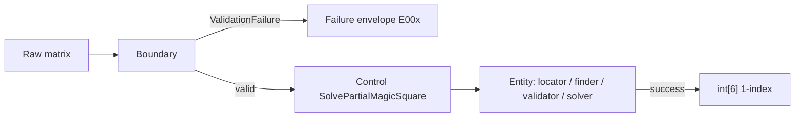

# PR: feature/dual-track-tdd → develop

**Repository:** https://github.com/sangun1217/MagicSquare_13  
**Compare:** https://github.com/sangun1217/MagicSquare_13/compare/develop...feature/dual-track-tdd

---

## Summary

This PR merges **`feature/dual-track-tdd`** into **`develop`** for the Magic Square 4×4 **Dual-Track TDD Practice** project. It delivers the full **Phase 1 RED** foundation: Sprint 0 ECB skeleton, QA documentation, Report/08 Full RED (AC-FR-01-01), extended Track A/B RED tests, Failure envelope contracts (E00x), and **27 pytest.fail skeletons** (Report/11).

No GREEN production logic is included—failures are intentional (`NotImplementedError` or `pytest.fail`).

## What changed

### Sprint 0 & project hygiene

- `pyproject.toml` — pytest, pytest-cov, ruff, black; markers `boundary` / `domain` / `integration`
- ECB package layout: `src/magicsquare/{boundary,control,entity}`
- `README.md` — Dual-Track TDD task board (Sprint 0–3, quality gates, branch rules)
- Golden fixtures `tests/fixtures/golden_grids.py` — G0/G1/G2/G3, TD_* invalid/solve vectors (DN-04 REV: `[2,2,10,3,3,7]`)

### Track A — Boundary / UI Contract (RED)

| Layer | Artifact | Purpose |
|-------|----------|---------|
| Report/08 Full RED | `tests/boundary/test_ac_fr01_01_invalid_size.py` | AC-FR-01-01 — null/empty/non-4×4 → `InvalidInputError` (32 tests) |
| Failure envelope | `src/magicsquare/boundary/failure.py` | E001–E005 + fixed messages |
| Stubs | `input_validator.py`, `ui_boundary.py` | FR-01 validate + solve entry (RED `NotImplementedError`) |
| Full RED | `test_track_a_red.py` | U-IN/E00x, U-OUT, U-FLOW-02 (assert-based) |
| Skeleton RED | `test_u_in.py`, `test_u_out.py`, `test_u_flow.py` | U-IN-04~08, U-OUT-01~03, U-FLOW-02×5 (`pytest.fail` only) |
| Legacy stub | `boundary_validator.py`, `solve_entry.py` | Charter/PRD parallel paths |

### Track B — Domain / Logic (RED)

| Layer | Artifact | Purpose |
|-------|----------|---------|
| Entity stubs | `blank_locator`, `missing_finder`, `magic_validator`, `solver` | FR-02~05 RED placeholders |
| Constants | `entity/constants.py` | `MAGIC_CONSTANT_N4 = 34`, grid bounds |
| Full RED | `tests/domain/test_track_b_red.py` | D-LOC, D-MIS, D-VAL, D-SOL (assert-based) |
| Skeleton RED | `tests/entity/test_d_*.py` | D-LOC-01 … D-SOL-04 (`pytest.fail`; D-SOL-02 G2 TBD) |

### QA & documentation

- `docs/test_plan.md` — AC-FR01-01 boundary test plan
- `docs/defect_list.md` — DEF-001~006 (RED evidence)
- `Report/09` — AC-FR-01-01 session
- `Report/10` — Dual-Track RED design + full RED test session
- `Report/11` — RED skeleton 27 tests session
- Matching `Prompting/09`, `10`, `11` backups

## Commits (6)

| Commit | Description |
|--------|-------------|
| `f73f833` | README Dual-Track checklist |
| `ca1dd92` | Sprint 0 project skeleton |
| `330d0ce` | AC-FR-01-01 RED, test plan, defect list, Report 09 |
| `3f6d758` | PR description draft |
| `c391ac7` | GitHub PR body draft |
| `e403f7c` | Track A/B RED stubs, full RED tests, skeletons, Report 10–11 |

**Diff vs `develop`:** 52 files, **+2845 / −9** lines

## Test plan

```bash
pip install -e ".[dev]"
pytest -q
```

### Latest run (RED phase — expected failures)

| Result | Count | Meaning |
|--------|-------|---------|
| **Failed** | 73 | Intentional RED — stubs + `pytest.fail` skeletons |
| **Passed** | 18 | Fixture smoke, scope guards, formatter smoke |

### Targeted runs

```bash
# Report/08 AC-FR-01-01 only
pytest tests/boundary/test_ac_fr01_01_invalid_size.py -v

# Skeleton only (all pytest.fail)
pytest tests/boundary/test_u_in.py tests/boundary/test_u_out.py tests/boundary/test_u_flow.py tests/entity/ -v

# Full Track A/B RED (assert-based)
pytest tests/boundary/test_track_a_red.py tests/domain/test_track_b_red.py -v
```

- [x] RED evidence documented in `docs/defect_list.md`
- [x] Dual-Track separation: `tests/boundary/` vs `tests/entity/` + `tests/domain/`
- [x] No assertion weakening for forced GREEN
- [ ] GREEN — follow-up PR(s) per track (`feat/bnd/*`, `feat/dom/*`)

## Architecture (ECB)



- Dependency direction: **boundary → control → entity** (no reverse imports)
- Invalid input: **Domain execute 0 calls** (U-FLOW-02 design + tests)

## Known issues (pre-GREEN)

| ID | Summary |
|----|---------|
| DEF-001 | `BoundaryValidator` / `InputValidator` — `NotImplementedError` until GREEN |
| DEF-003 | Charter `INVALID_SIZE` vs PRD `ERR-VAL-001` message/code — unify before GREEN |
| DEF-005 | `TD_INVALID_SIZE` naming vs 3×4/4×3 fixtures |
| Design | E00x Failure envelope vs `InvalidInputError` — dual contracts in parallel tests |
| Design | D-SOL-01 `[2,2,7,3,3,10]` vs D-SOL-02 G2 TBD — fixture lock at GREEN |

## Out of scope

- GREEN implementation (FR-01~05)
- REFACTOR / coverage CI gates (80% floor, 85%/95% layer targets)
- UI, DB, Web API

## Reviewer checklist

- [ ] Confirm RED failures are intentional, not regressions
- [ ] ECB import direction respected in new modules
- [ ] Report/08 `test_ac_fr01_01` assertions unchanged in spirit (Full RED)
- [ ] Skeleton tests (`pytest.fail`) clearly separated from Full RED asserts
