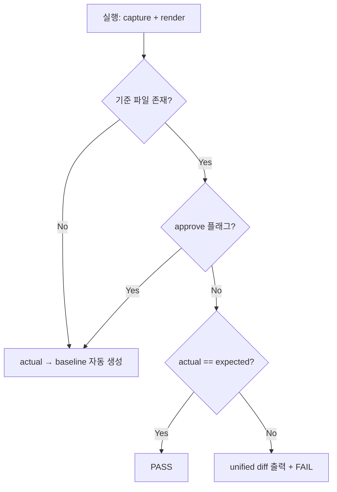

# Golden Master / Approve Pattern — Magic Square Solver

| 항목 | 내용 |
|------|------|
| **문서 ID** | GM-MSQ-APPROVE-001 |
| **버전** | 1.0 |
| **대상** | Magic Square Solver end-to-end 출력 회귀 |
| **기준 파일** | `tests/golden_master_expected.txt` |

---

## 1. 목적

Solver의 **관찰 가능한 최종 출력**(성공 벡터 또는 오류 라벨)을 Golden Master baseline으로 고정하고, 이후 변경 시 **의도적 approve** 없이는 baseline이 바뀌지 않도록 한다.

---

## 2. 캡처 전략

### 2.1 입력 시나리오

| Section ID | 의미 | Fixture / Grid |
|------------|------|----------------|
| `normal_success` | GM-TC-01 정상 조합 (small-first) | `G1_SF` |
| `reverse_success` | GM-TC-02 reverse fallback | `G1` |
| `invalid_blank_count` | GM-TC-03 빈칸 개수 위반 | `TD_INVALID_BLANK_THREE` |
| `duplicate_number` | GM-TC-04 중복 숫자 | Golden Master 전용 격자 |
| `no_valid_magic_square` | GM-TC-05 두 attempt 실패 | Golden Master 전용 unsolvable 격자 |

시나리오 정의 SSOT: `tests/golden_master/scenarios.py`

### 2.2 출력 캡처 방식

**Result DTO serialize** (채택):

- 진입점: `UIBoundary.solve(matrix)`
- 성공: `Output:\n[r1,c1,n1,r2,c2,n2]`
- Boundary 검증 실패: `Error:\n<LABEL>` (Golden Master 전용 라벨)
- Domain 불가: `Error:\nNO_VALID_SOLUTION`

Golden Master 오류 라벨 매핑 (`tests/golden_master/capture.py`):

| 내부 코드 | Golden Master 라벨 |
|-----------|-------------------|
| `E002` | `INVALID_BLANK_COUNT` |
| `E005` | `DUPLICATE_NUMBER` |
| `UnsolvableDomainError` | `NO_VALID_MAGIC_SQUARE` |

stdout capture는 CLI/BCLI GREEN 이후 확장 가능; 현재는 DTO serialize가 SSOT이다.

---

## 3. Approve 패턴

### 3.1 상태 전이



### 3.2 Approve 트리거

| 방법 | 용도 |
|------|------|
| `python scripts/generate_golden_master.py` | baseline 최초 생성 |
| `python scripts/generate_golden_master.py --approve` | baseline 강제 갱신 |
| `PYTEST_APPROVE=1 pytest tests/integration/test_golden_master.py` | 테스트 실행 중 approve |
| baseline 파일 없음 | compare 단계에서 자동 생성 (approve와 동일) |

구현 SSOT: `tests/golden_master/approve.py` — `approve_or_assert()`

### 3.3 불일치 시 동작

1. 전체 문서 unified diff 출력
2. section별 unified diff 추가 출력
3. `AssertionError`로 FAIL
4. 메시지에 `PYTEST_APPROVE=1` 재실행 안내 포함

---

## 4. 기준 파일 구조

```
[normal_success]
Input:
16 2 3 13
5 11 10 8
9 7 0 12
4 14 15 0
Output:
[3,3,6,4,4,1]
________________________________________

[reverse_success]
Input:
...
Output:
[2,2,10,3,3,7]
________________________________________

[invalid_blank_count]
Input:
...
Error:
INVALID_BLANK_COUNT
________________________________________

[duplicate_number]
...
Error:
DUPLICATE_NUMBER
________________________________________

[no_valid_solution]
...
Error:
NO_VALID_SOLUTION
```

규칙:

- Section 헤더: `[section_id]` (단독 한 줄)
- Section 구분: `________________________________________` (40 underscores)
- Input 블록: `Input:` + 4행 공백 구분 정수
- 성공: `Output:` + `[n,n,n,n,n,n]` (쉼표, 공백 없음)
- 실패: `Error:` + Golden Master 라벨 (한 줄)

---

## 5. 파일 맵

| 파일 | 역할 |
|------|------|
| `tests/golden_master_expected.txt` | 버전 관리되는 baseline |
| `tests/golden_master/scenarios.py` | 입력 시나리오 SSOT |
| `tests/golden_master/capture.py` | Solver → serialize |
| `tests/golden_master/approve.py` | parse / compare / approve |
| `scripts/generate_golden_master.py` | baseline 생성 CLI |
| `tests/integration/test_golden_master_magic_square.py` | pytest GM-TC-01~05 회귀 테스트 |
| `tests/golden_master/contracts.py` | int[6] / row-major / attempt 계약 검증 |

---

## 6. 실행 예

```bash
# baseline 생성 (최초 또는 갱신)
python scripts/generate_golden_master.py --approve

# 회귀 테스트
pytest -m golden_master -v

# 출력 변경 후 baseline 갱신
PYTEST_APPROVE=1 pytest -m golden_master -v

# 버전 관리 포함
git add tests/golden_master_expected.txt
```

---

## 7. CI 권장

- PR CI: `pytest -m golden_master -v` (approve **금지**)
- baseline 변경 PR: diff 리뷰 필수; `--approve` 로 생성된 파일만 커밋
- Solver/Formatter/Validator 계약 변경 시 Golden Master를 의도적으로 갱신

---

## 8. 제약 및 확장

- Golden Master는 **end-to-end 관찰 출력**만 검증; Entity 단위 assert와 중복하지 않는다.
- 새 시나리오 추가: `scenarios.py` → `generate_golden_master.py --approve` → baseline diff 리뷰.
- CLI stdout 계약 GREEN 시 `capture.py`에 stdout adapter 추가 가능 (현재 Out-of-Scope).
